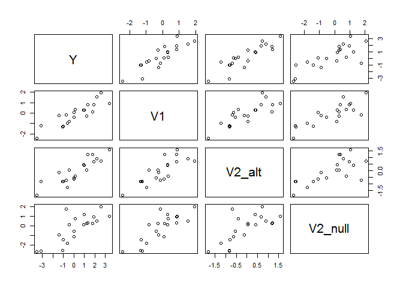

Searching for significance in correlated variables
--------------------------------------------------

Business problem: A manager suspects that a given variable
*V*2 is significantly predictive of a *Y*, but
*V*2 is extremely correlated with *V*1, a variable
already incorporated into your company's simple linear model.

The manager wants the answer *now*: is *V*2 important or not?

Some things to consider:

1.  Is it informative/safe to look at linear model coeffecients in a
    regression of *V*1 and *V*2 on *Y*?

2.  What other strategies are worth considering?

3.  Does running a linear model on the residuals of a first stage model
    help?

4.  How can we measure results in terms of false postives vs. false
    negatives?

* * * * *

Setup
-----

Let's use the following setup to test
[*V*1, *V*2] ∼ *N*(*μ*, Σ)

With *c**o**v*(*V*1, *V*2) = .9,
*v**a**r*(*V*1) = *v**a**r*(*V*2) = 1

Let *V*3 ∼ *N*(*V*2, .5)

*Y* ∼ *N*(*V*1 + *V*2, 1)

### Approach:

We test both under the null hypothesis that *V*2 contains no
additional information (*V*2*n**u**l**l*) and the alternative
hypothesis in which *V*2 does contain information
(*V*2*a**l**t*)

    library(MASS)
    library(magrittr)
    library(dplyr)
    set.seed(5000)

    createSigma <- function(corr=.9) {
    Sigma <- diag(4) 
    Sigma[1,2] = Sigma[2,1] = .9
    return(Sigma)
    }

    simulateData <- function(V2coef=1,corr=.9,n=20) {
      mvrnorm(n = n, mu=rep(0,4), createSigma(corr), tol = 1e-6, empirical = FALSE, EISPACK = FALSE) %>% 
      as.data.frame %>%
      rename(V2_alt = V2, e1 = V3, e2 = V4) %>%
      transform(Y=  V1 + V2_alt + e1,
                V2_null = V1 + e2) %>% return
    }

    sampleData <- simulateData()
    with(sampleData,
         plot(Y,V1))

Inspecting the linear models, you'd probably be surprised to see

    simulation <- list(data = sampleData)
    simulation$results <- with(simulation$data, list(
      fullModel = lm(Y ~ V1 + V2_alt +V2_null),
      v1Model = lm(Y ~ V1),
      v2_alt_Model = lm(Y ~ V1 + V2_alt),
      v2_null_Model = lm(Y ~ V1 + V2_null)))

    #to do lapply(simulation$results, function(x) {assign(names(x)) = x})
    attach(simulation$results) #just for this demo
    summary(fullModel)$coef

    ##              Estimate Std. Error   t value   Pr(>|t|)
    ## (Intercept) 0.3592781  0.1689855 2.1260884 0.04941089
    ## V1          0.6044075  0.3548356 1.7033451 0.10784533
    ## V2_alt      0.9538173  0.3316292 2.8761561 0.01097033
    ## V2_null     0.1791071  0.2109676 0.8489793 0.40841601

So, the new variable *V*2 is significant but your old variable *V*1 no
longer is... My first thought would be to use ANOVA:

    anova(fullModel)

    ## Analysis of Variance Table
    ## 
    ## Response: Y
    ##           Df Sum Sq Mean Sq F value    Pr(>F)    
    ## V1         1 46.195  46.195 83.1396 9.767e-08 ***
    ## V2_alt     1  4.901   4.901  8.8208  0.009027 ** 
    ## V2_null    1  0.400   0.400  0.7208  0.408416    
    ## Residuals 16  8.890   0.556                      
    ## ---
    ## Signif. codes:  0 '***' 0.001 '**' 0.01 '*' 0.05 '.' 0.1 ' ' 1

    anova(v1Model,v2_alt_Model)

    ## Analysis of Variance Table
    ## 
    ## Model 1: Y ~ V1
    ## Model 2: Y ~ V1 + V2_alt
    ##   Res.Df     RSS Df Sum of Sq      F   Pr(>F)   
    ## 1     18 14.1918                                
    ## 2     17  9.2907  1    4.9011 8.9681 0.008147 **
    ## ---
    ## Signif. codes:  0 '***' 0.001 '**' 0.01 '*' 0.05 '.' 0.1 ' ' 1

Note that Sum of Squares are the same as the first comparison in
anova(fullModel), but degrees of freedom are different. That's why
anova(model1,model2) is best.

    anova(v1Model,v2_null_Model)

    ## Analysis of Variance Table
    ## 
    ## Model 1: Y ~ V1
    ## Model 2: Y ~ V1 + V2_null
    ##   Res.Df    RSS Df Sum of Sq     F Pr(>F)
    ## 1     18 14.192                          
    ## 2     17 13.486  1   0.70526 0.889  0.359

Someone I talked to suggested first regressing Y on V1, and then the
residuals on V2.

    v2_alt_ResidModel <- lm(resid(v1Model) ~ sampleData$V2_alt - 1)
    summary(v2_alt_ResidModel)$coef

    ##                    Estimate Std. Error  t value Pr(>|t|)
    ## sampleData$V2_alt 0.3193023  0.2057836 1.551641 0.137246

    v2_null_ResidModel <- lm(resid(v1Model) ~ sampleData$V2_null -1 )
    summary(v2_null_ResidModel)$coef

    ##                      Estimate Std. Error   t value  Pr(>|t|)
    ## sampleData$V2_null 0.07502617  0.1360327 0.5515304 0.5876987

I wouldn't recommend this approach.

Followup Questions!
-------------------

1.  looking at linear model coeffecients is safe/not safe (pick one)

2.  ANOVA is better/not better

3.  We could compare procedures by using what metrics?

Simulations
-----------

It would be better to draw conclusions from more than one observation!

    #todo!

    singleSimulation <- function(corr,true_effect,n_obs) {
      #input:  
      #output: a list with two linear models
      data <- simulateData(V2coef = true_effect,corr = cor,n=n_obs)
      res <- list()
      res$model_null <- lm(Y~V1 + V2_null,data=data)
      res$model_alt <- lm(Y~V1 + V2_alt,data=data)
      return(res)
    }

    # testWithPValue <- function(linear_model) {
    #   #input: a single linear model)
    #   #output: p-value associated with ..? 
    #   (summary(linear_model)$coef[,colnames(summary(linear_model)$coef)=="Pr(>|t|)"]) %>%
    #     return
    # }

    returnCoeffecients <- function(linear_model) {
      #input: a single linear model
      #output: two coeffecients
      linear_model$coef[3] %>% #[c("V2_alt","V2_null")] %>% // only return one?? 
        return
    }

    returnPValue <- function(linear_model) {
      temp <- linear_model %>% summary %>% `$`(coef) %>% `[`(3,4)
      #print(linear_model)
      return(temp)
      
      
    }

    testMethod <- function(significantMethod=returnCoeffecients, corr=seq(0,.95,by=.05),true_effect=(1:10), n_obs=20,n_sim=10) {
      #input: significantMethod function
      #corr: numeric vector correlation of the two variables
      #true_effect: numeric vector of true effects to measure.
      #for each combination of parameters (creates a matrix of all possible parameters)
      #and the false positive result
      true_effect <- c(true_effect) #test type II error as well! 
      sim_results <- expand.grid(corr=corr,true_effect=true_effect,n_obs=n_obs,n_sim=1:n_sim)
      sim_results[paste0("sim_",1:n_sim)] <- NA
      #now, you can run these simulations however you want
      #generate data
      apply(sim_results[c("corr","true_effect","n_obs","n_sim")],1,
            function(x) {
              c(
                x["corr"],
                x["true_effect"],
                x["n_obs"],
                x["n_sim"],
                singleSimulation(corr=x["corr"],true_effect=x["true_effect"] , n_obs = x["n_obs"]) %>% #returns list of two
                sapply(.,significantMethod)
                ) %>%
              #pull coef of interest from both regressions
              return
            }
          ) %>% 
        t %>%
        as.data.frame %>%
        return
    }

    res<-testMethod(significantMethod=returnPValue)
    head(res)

    ##   corr true_effect n_obs n_sim model_null    model_alt
    ## 1 0.00           1    20     1  0.7918351 0.0129043945
    ## 2 0.05           1    20     1  0.5945826 0.9576066819
    ## 3 0.10           1    20     1  0.1545579 0.0109504294
    ## 4 0.15           1    20     1  0.6091482 0.0004814217
    ## 5 0.20           1    20     1  0.3770710 0.1512967351
    ## 6 0.25           1    20     1  0.3968821 0.5714061035

    save(res,file="res.RData")

    euclideanDistance <- function(x,y) {
      return(sqrt(sum((x-y)^2)))
    }

    binaryClassification <- function(model_null,model_alt) {  
      (model_null < .05) + (model_alt > .05) %>%
      return
      }

    # create a summary
    createHeatMap <- function(df,lossFunction=binaryClassification,only_n_obs=20) {
      library(gplots)
      library(tidyr)
      # input: testMethod-result dataframe
      # output: summary data frame
      # side effect: print out a heatmap with loss function
      names(df) <- c("corr","true_effect","n_obs","n_sim","model_null","model_alt")
      temp <- 
      df %>% 
        mutate(true_null=0) %>%
        mutate(loss = binaryClassification(model_null,model_alt)) %>%
         group_by(corr,true_effect,n_obs) %>%
        mutate(true_null = 0) %>%
        summarise(meanLoss = sum(loss)/n())
      print(head(temp))
      
    #   toPlot <- temp %>% 
    #     select(corr,true_effect,meanLoss) %>%
    #     spread(true_effect,meanLoss) %>%
    #   row.labels <- toPlot[,1] #corr values
    #   toPlot %>% as.matrix %>%
    #     heatmap.2(.,Rowv=NULL,Colv=NULL,dendogram="none",trace="none",
    #               key=FALSE,labCol=row.labels,cexCol=1)
      return(temp)

    }

    sim_res <- createHeatMap(res,lossFunction=binaryClassification)

    ## 
    ## Attaching package: 'gplots'
    ## 
    ## The following object is masked from 'package:stats':
    ## 
    ##     lowess
    ## 
    ## 
    ## Attaching package: 'tidyr'
    ## 
    ## The following object is masked from 'package:magrittr':
    ## 
    ##     extract

    ## Source: local data frame [6 x 4]
    ## Groups: corr, true_effect
    ## 
    ##   corr true_effect n_obs meanLoss
    ## 1    0           1    20      0.9
    ## 2    0           2    20      0.8
    ## 3    0           3    20      0.3
    ## 4    0           4    20      0.7
    ## 5    0           5    20      0.6
    ## 6    0           6    20      0.7

    head(sim_res)

    ## Source: local data frame [6 x 4]
    ## Groups: corr, true_effect
    ## 
    ##   corr true_effect n_obs meanLoss
    ## 1    0           1    20      0.9
    ## 2    0           2    20      0.8
    ## 3    0           3    20      0.3
    ## 4    0           4    20      0.7
    ## 5    0           5    20      0.6
    ## 6    0           6    20      0.7

    save(sim_res,file="heatmap.RData")

    # toPlot <- sim_res %>% 
    #   dplyr::select(corr,true_effect,meanLoss) %>%
    #   tidyr::spread(corr,meanLoss) %>%
    #   data.matrix 
    # 
    # row.names(toPlot) <- toPlot[,1]
    # 
    # heatmap(toPlot[,2:20],Rowv=NA,Colv=NA,col=cm.colors(256),scale="column",margins=c(5,10))
    #   heatmap.2(Rowv = FALSE,Colv=FALSE,dendrogram="none")
